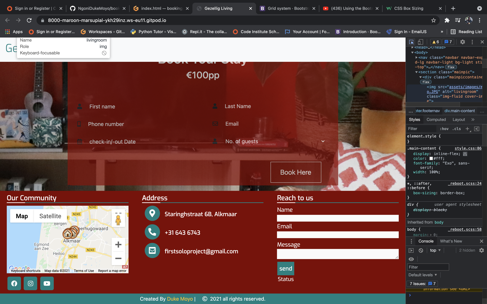
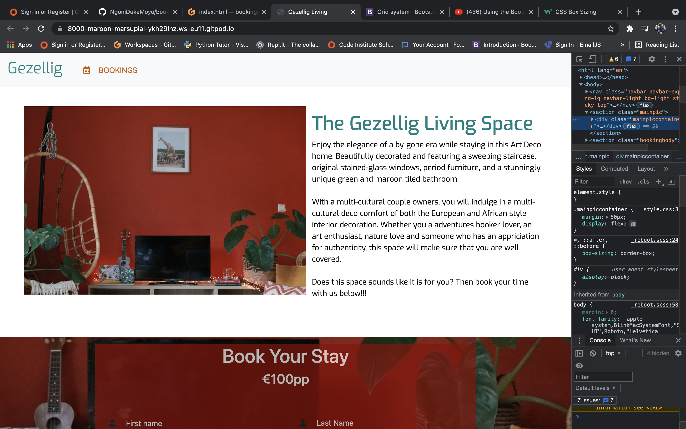
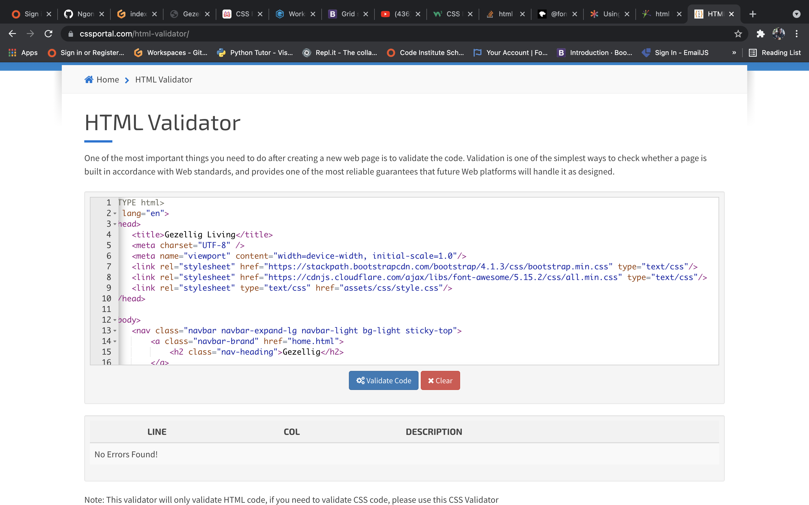
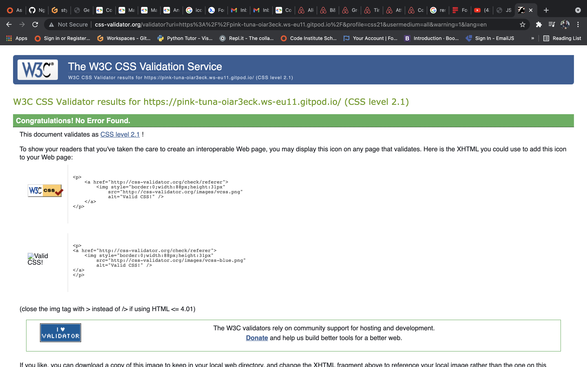
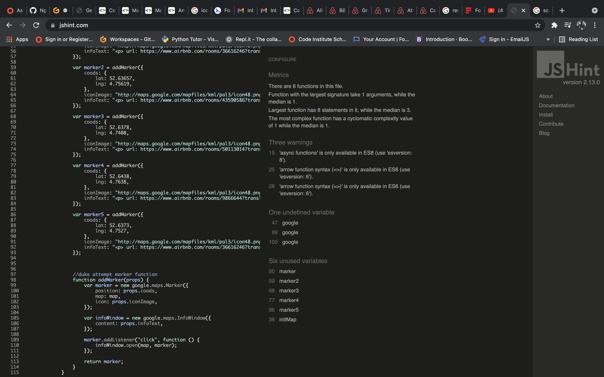
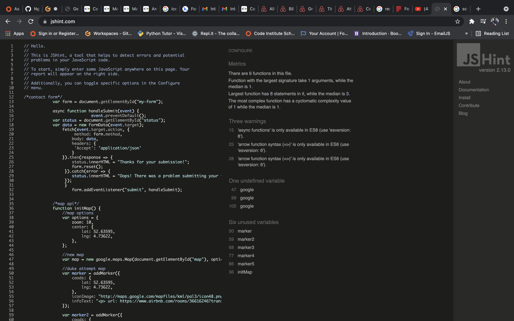
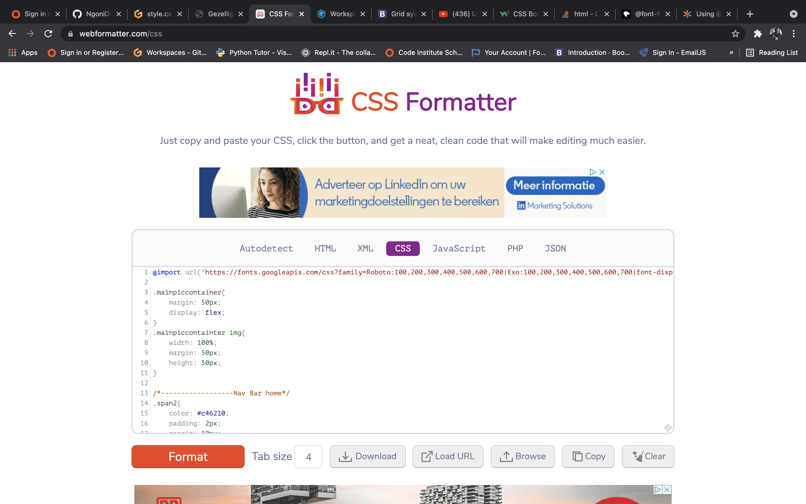
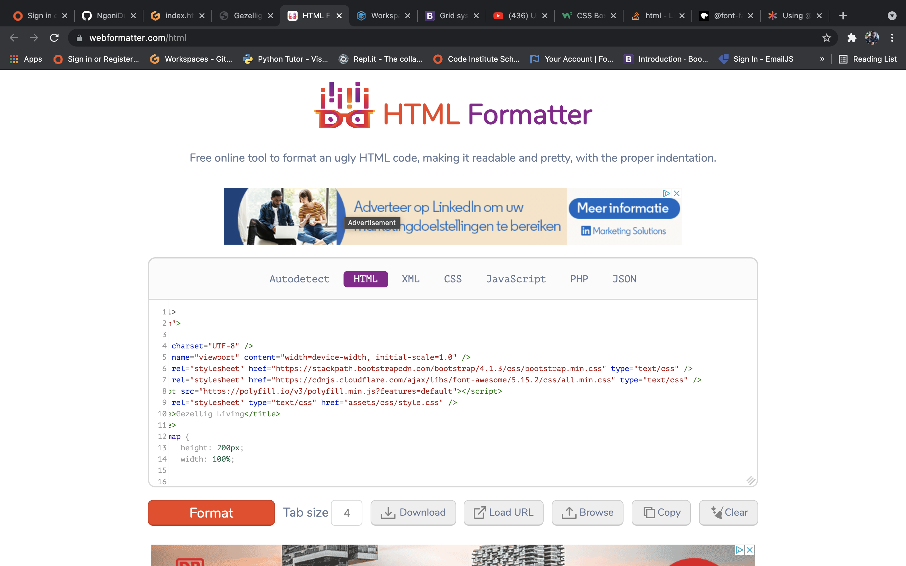

<!--Heading-->
# Gezelling Living Booking Page

  
  
This is the main look for the website. It is designed to be responsive and accessible on mobile and large screen devices. 

The aim is to create a platform were customers come searching for a creative rental space to book. 

<!--UX & User stories-->

# User Experience

## User Stories
### First time visitors Goals
As a first time visitor, i want to easily understand the main purpose of the website.
As a first time visitor, i want to be able to easily navigate throughout the site to find what is the offer what i am searching for.

### Second Visitors Goals
As a second visitor i want to find out about any additional updates to other near offers in the area.
As a returning visitor i want to find the best way to get in contact with the organisation with any questions i may have.

### Frequent User Goals
As a Frequent User i want to up to date updates or know changes to the website or the accomodation. And this done through out socials and the google API.

<!--Design-->
## Color Scheme
The main colors used are Maroon, teal and yellow.
I want to go on the website and be immidiately capitivated with the colors and the furniture with the way it is displayed, then simply press book.

## Typography
The Exo font family is the main font used throughout the whole website with San Serif as the fallback font incase the font isnt being imported into the site correctly.
I chose the font "Exo" because of its simplicity but neat impression which compliments the aim of the website itself.

## Imagery

The large heading image backed by the dsscription is designed to automatically prompt the viewer about the design, colors and idea of the space. 

The header and navbar provide clear and simple info to make it as quick and easy interaction.

## wireframes

<!--features-->

## features
-Google maps API 
-Formspree API 

# Technologies used
## Languages used
-HTML5 
-CSS3 
-JavaScript 

## Frameworks, Libraries & Programs used
-Bootstrap 4.4.3 : Bootstrap was used to assist with responsiveness and styling of the website. Bootstrap also was used to create the Gallery's rows and columns for design. 
-Hover.CSS : Hover was used on social Media icons in the footer to add color change indicating option while being hovered over. 
-Google Fonts : Google fonts were used to import the Exo font family into the style.css file which is used on all pages throughout the project. 
-Font Awesome 5.15.2 : Font Awesome was used on all pages throughout the website to add icons for UX purposes. 
-JQuery 3.3.1 : JQuery came with Bootstrap to make the navbar responsive. 
-Git : Git was used for version control by utilizing the Gitpod terminal to commit to Git and Push to GitHub.  
-GitHub : GitHub was used to store the projects code after being pushed from Git. 
-Git Pages for deployment

# Testing 

-W3C Markup Validator :  
-W3C CSS Validator :  
-google chrome dev tool - lighthouse 
-Code Formatter

  
  
  
  
  

# Testing User Stories from User Experience
## First time visitor Goals

.When i enter the site users are exposed to a clean and readable navigation bar to got to the page of choice. 
.Users have the option of navigating with the navbar or scroll to the bottom to access footer with socials and contact. 
-As a First time Visitor, i want to be able to easily be able to navigate through the site to find content about the product. 
.The site is designed in the way that the user is not entrapped. At the top of each page has a navigation bar with each link describing the location it will lead. 
.At the bottom of all pages in footer for contact and social media also used as platform for reviews, to ensure the visitor always has somewhere to go. 

## Returning Visitor Goals
-As a Returning Visitor, i want to find the new updates or discounts on the accomodation. 
.The users will access these updates through the social media platforms which will be regulary updated with offers and updates of the accomodation. 

## Frequent User Goals
-Socials to access the everyday updates. 

# Further Testing
-The site was tested on google chrome and safari. 
-The site was views on mobile and large screen devices 
-Alot of test done to ensure that all pages were linking correctly 

# Bugs
-Devices view 

# Deployment

## GitHub Deployment
-The project was deployed to GitHub Pages using the following steps :
.Log into the GitHub and locate the GitHub Repository 
.Go to settings button on the menu 
.Scroll down to pages section 
.under source click the dropdown named "none" and select "Master Branch" 
.Scroll down through the page to find the now published link in GitHub pages section. 

# Credits
## code
-Bootstrap Library used through out the project, mainly ( Grid systems, Navbar and navbar toogle, gallery)

## content
-All content was written by the developer.

## Media 
-All images were created by the developer.

## Acknowledgements
-My mentor for helping through this process  
-Tutor support with alot of bugs 
-Colors (https://www.rapidtables.com/web/color/brown-color.html) 
-Video Compress (https://www.youcompress.com/) 
-Google Fonts 
-CodingNepal (responsive footer) 
-Traversy Media(tutorials) 
-Clever Techie(tutorials) 
-Code Institute (Readme file) 

 

<!--Challenges faced in Project-->
  # challenges
  -View options with bootstrap grit system 
  -infowindow content  

